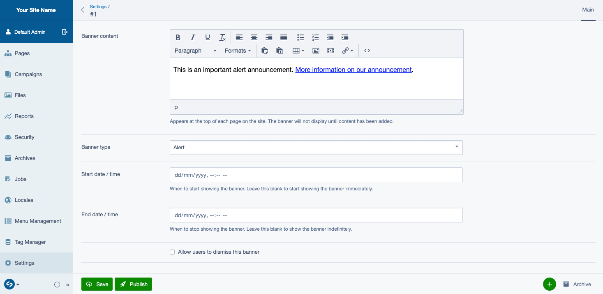

# Site Wide Banners

Allows CMS authors to create site-wide banners, to alert visitors of important information regardless of the page they're viewing.

## Features

 * Themeable templates
 * Configure type of alert (defaults to "info", "warning" and "alert")
 * Multiple concurrent alerts
 * Set start/end dates for alert
 * Permission controls
 * Localisation of CMS UI controls and labels
 * Preview and publish through versioning
 * CMS users can make banners "dismissible", allowing users to hide banners after reading.
 * Rich-text editing (insert links and images)
 * Optional: Sorting through [gridfieldextensions](https://github.com/symbiote/silverstripe-gridfieldextensions)
 * Support for [subsites](https://github.com/silverstripe/silverstripe-subsites)

## Screenshot



## Installation

	composer require nzta/silverstripe-sitebanner

## Configuration

#### Site settings
Add the following to your YAML config to configure the module:

	SilverStripe\SiteConfig\SiteConfig:
	  extensions:
	    - NZTA\SiteBanner\Extensions\SiteConfigExtension

Add the following environment variable to you `.env` file to activate the
 module in site settings:

```
SITEBANNER_SITECONFIG=1
```

The site banner can be configured in `admin/settings` now.

#### Model admin
By default, the site banners are managed from the model admin interface.

## Templates

In order to show the banners, you need to add them to your template:

	<% loop $SiteConfig.SiteBanners %>
        <div id="site-banner-$ID" class="site-banner site-banner-$Type site-banner--hidden" role="alert" data-id="$ID" aria-hidden="true" data-nosnippet>
            $Content
            <% if $Dismiss %>
                <button class="site-banner-close" aria-label="Close" data-id="$ID">×</button>
            <% end_if %>
        </div>
	<% end_loop %>

## Bootstrap Styles

If you're using Bootstrap, it's easy to get useful default styles for alerts
through a combination of [contextual backgrounds](http://getbootstrap.com/css/#helper-classes-backgrounds)
and [icons](http://getbootstrap.com/components/#glyphicons).

	<% loop $SiteConfig.SiteBanners %>
        <% if $Type == 'info' %>
            <p class="bg-info site-banner site-banner-$Type site-banner--hidden" role="alert" data-id="$ID" aria-hidden="true" data-nosnippet>
                <span class="glyphicon glyphicon-info-sign" aria-hidden="true" />
                $Content
            </p>
        <% end_if %>
        <% if $Type == 'warning' %>
            <p class="bg-warning site-banner site-banner-$Type site-banner--hidden" role="alert" data-id="$ID" aria-hidden="true" data-nosnippet>
                <span class="glyphicon glyphicon-warning-sign" aria-hidden="true" />
                $Content
            </p>
        <% end_if %>
        <% if $Type == 'alert' %>
            <p class="bg-danger site-banner site-banner-$Type site-banner--hidden" role="alert" data-id="$ID" aria-hidden="true" data-nosnippet>
                <span class="glyphicon glyphicon-warning-sign" aria-hidden="true" />
                $Content
            </p>
        <% end_if %>
	<% end_loop %>

Examples on the SilverStripe default theme:


## Permissions

By default, every author with access to the "Settings" section (`EDIT_SITECONFIG` permission code)
can set alerts. You can customise this by YAML configuration:

	NZTA\SiteBanner\Models\SiteBanner:
	  required_permission_codes:
	    - ADMIN

## Sorting

You can allow authors to sort multiple alerts by installing
the [gridfieldextensionsn](https://github.com/symbiote/silverstripe-gridfieldextensions) module.
It'll get automatically picked up by the code.

## Limitations

 * Does not trigger republish when [staticpublisher](https://github.com/silverstripe/silverstripe-staticpublisher) is used
